# Rail Data Pipeline and API

[](https://github.com/OmarM-Devv/rail-data-pipeline-api/actions/workflows/deploy.yml)

A pandas pipeline that cleans the Office of Rail and Road's station usage data
([ORR Table 1410](https://dataportal.orr.gov.uk/), April 2024 to March 2025),
served by a FastAPI REST API. The API runs in Docker on AWS EC2, on
infrastructure provisioned with Terraform, and is deployed by a GitHub Actions
workflow on every push to `main`.

The cleaning pipeline started as
[rail-data-pipeline](https://github.com/OmarM-Devv/rail-data-pipeline). This
repository adds the REST API, the container image, the Terraform
infrastructure and the CI/CD deployment.

## At a glance

| | |
|---|---|
| What it does | Downloads ORR Table 1410, cleans and validates it, reshapes ticket types into rows, and serves station lookups, regional totals and busiest-station rankings over a REST API |
| Data | 2,589 stations and 7,767 ticket-type rows (2,589 × 3) from the 2024-25 release |
| Stack | Python 3.14, pandas, FastAPI, Docker, Terraform, AWS (EC2, ECR, IAM, SSM), GitHub Actions |
| Tests | 15 pytest cases, 85% line coverage, ruff lint and format checks, on every push and pull request |
| Deployment | Deployed to AWS `eu-west-2` and verified on 28/09/2026. A demo stack that may be torn down to save costs; `terraform apply` and a push to `main` recreate it |
| Evidence | [System verification](#system-verification): screenshots of the pipeline, the deploy, the running service and the AWS resources |
| Design decisions | Four [architecture decision records](docs/adr/) covering the options considered and the trade-offs |

The database side of my work (PostgreSQL schema design, SQL analytics,
transactional loading) is in
[matchlens-analysis](https://github.com/OmarM-Devv/matchlens-analysis).

## Live API

| | |
|---|---|
| Health | http://16.61.66.47:8000/health |
| Interactive docs (Swagger) | http://16.61.66.47:8000/docs |
| Example | http://16.61.66.47:8000/analytics/top-stations?n=5 |

Plain HTTP on port 8000, with no TLS or custom domain. This is a demo stack
and may be torn down to save costs. If the links don't respond, the
[System verification](#system-verification) screenshots show it running.

## Skills demonstrated

### Software engineering

- **Separation of concerns.** `pipeline/` cleans and validates; `api/` serves.
  The API imports the pipeline's `SCHEMA`, so the column types the pipeline
  validates are the types the API reads back.
- **Validation design.** A 20-column schema with a type and nullability rule
  for each column. The station count must be between 2,000 and 3,500 (the real
  file has 2,589). Three-letter codes and National Location Codes must be
  unique and well formed, measurements must not be negative, and the three
  ticket-type counts must add up to the all-tickets total. The reshaped table
  is checked too. Both output files are validated before either is written,
  and any failure stops the run with exit code 1
  ([Figure 3](#figure-3--validation-stops-bad-data)). See
  [ADR 0004](docs/adr/0004-validate-before-writing-keep-last-good-data.md).
- **Missing-value policy.** `[z]` ("not applicable") is read as missing, never
  as zero. A `usage_reported` flag records which stations reported usage, and
  rankings exclude unreported stations instead of counting them as zero.
- **API design.** Typed Pydantic response models, bounded query parameters
  (`limit` 1–500, `n` 1–100), 404 for unknown station codes, 503 when the data
  file is not loaded, and a catch-all handler that logs the error without
  returning internal details.
- **Tests.** 15 pytest cases run the real pipeline on a small fixture CSV that
  contains a duplicate station, blank rows, `[z]` values and a station name
  with a note marker, then test the API against its output. One simulates a
  disk filling up part-way through a write.

### Data engineering

- **Staged pipeline.** Fetch (raw bytes saved unchanged) → load (skipping the
  preamble rows, parsing thousands separators) → normalise headers → apply the
  missing-value policy → deduplicate → validate → reshape → validate → save →
  check the saved files.
- **Wide-to-long reshape.** The three ticket-type columns become rows (one per
  station and ticket type), validated as exactly three rows per station with
  no duplicate station and type pairs.
- **Real-data run.** From the deploy log on 28/09/2026: 2,589 stations,
  7,767 ticket rows, 0 duplicates removed, 3 stations without reported usage.
- **Automated refresh with a safe fallback.** Every deploy re-runs the pipeline
  in a one-off container before the API starts. Output files are written to a
  temporary file and renamed into place, so an interrupted write can never
  leave a truncated file. If the refresh fails, the previous data file is kept
  and served.
- **Types chosen for the data.** National Location Codes stay as text because
  they are identifiers. Counts use pandas' nullable `Int64`, so missing values
  stay missing.

### DevOps

- **Infrastructure as code.** [`terraform/`](terraform/) creates every AWS
  resource, with validation rules on the inputs: the instance type is locked to
  `t3.micro` (1 GiB), and the SSH CIDR cannot be `0.0.0.0/0`. The instance uses
  IMDSv2 only, with a hop limit of 1, so containers on the Docker bridge network
  cannot fetch the instance's credentials. Its disk is an encrypted gp3 volume.
  AMI updates are ignored so that a new image does not silently replace the
  server.
- **Container registry.** ECR with immutable tags (the commit SHA), scan on
  push, and a lifecycle policy that keeps the 3 most recent images.
- **Keyless CI/CD identity.** GitHub Actions gets short-lived AWS credentials
  through OIDC; there are no AWS secrets in the repository. The IAM trust
  policy matches GitHub's immutable subject claim, which includes numeric owner
  and repository IDs, so only `main` of this repository can assume the deploy
  role, even if the name is later reused. The role can push to one ECR
  repository and send SSM commands to one instance. See
  [ADR 0002](docs/adr/0002-github-oidc-with-immutable-subject.md).
- **Health-gated deploys with rollback.** The deploy runs over SSM Run Command,
  so it needs no inbound SSH. It replaces the API container, waits for
  `/health`, and rolls back to the previous image if the check fails. See
  [ADR 0001](docs/adr/0001-deploy-with-ssm-run-command.md).
- **Container hardening and limits.** Non-root UID 10001, read-only root
  filesystem, all Linux capabilities dropped, `no-new-privileges`, log rotation
  (3 × 10 MB), and `--memory 700m` (700 MiB) on both the pipeline and API
  containers, leaving headroom on the 1 GiB instance. See
  [ADR 0003](docs/adr/0003-single-t3-micro-with-docker.md).
- **Health endpoint.** `/health` reports status, version, `rows_loaded` (2,589)
  and the data file's timestamp, and returns 503 when the data is not loaded.
  The Docker `HEALTHCHECK` and the deploy gate both use it. There are no
  dashboards or alerts, and CloudWatch detailed monitoring is off.

## Documentation

| Document | Kind | Use it to |
|---|---|---|
| [Running locally](#running-locally) | Tutorial | Run the pipeline, API and tests on your own machine |
| [Setting it up in your own AWS account](#setting-it-up-in-your-own-aws-account) and [Cost and teardown](#cost-and-teardown) | How-to | Deploy the stack, then remove it |
| [Endpoints](#endpoints), [What Terraform creates](#what-terraform-creates-terraform-region-eu-west-2), and the OpenAPI docs at `/docs` | Reference | Look up the API and the AWS resources |
| [Architecture decision records](docs/adr/) and [OIDC subject claim](#oidc-subject-claim) | Explanation | Understand why the design is the way it is, and its trade-offs |

## Endpoints

| Method and path | Description |
|---|---|
| `GET /health` | Service status, rows loaded and data file timestamp. Returns 503 if the data is not loaded. |
| `GET /stations` | Paginated station list. Query: `limit` (1-500), `offset`, `region`, `name` (contains), `sort` (`name` or `usage`). |
| `GET /stations/{code}` | One station by three-letter code (any case, e.g. `kgx`) or numeric NLC. |
| `GET /regions` | Station count and total entries/exits per region. |
| `GET /analytics/top-stations` | Busiest stations. Query: `n` (1-100), `region`, `ticket_type` (`all`, `full_price`, `reduced_price`, `season`). Stations without reported usage are excluded rather than counted as zero. |

```bash
curl "http://127.0.0.1:8000/analytics/top-stations?n=3"
```

## Architecture

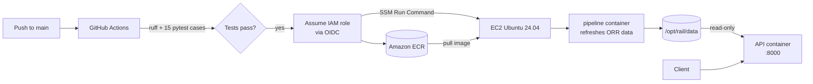

## Project layout

```
api/                  FastAPI application (api/app.py)
pipeline/             Pandas cleaning and validation pipeline (pipeline/cleaner.py)
tests/                pytest suite and a sample ORR CSV fixture
terraform/            AWS infrastructure (EC2, ECR, IAM, GitHub OIDC)
.github/workflows/    CI/CD workflow (deploy.yml)
docs/adr/             Architecture decision records
docs/images/          Screenshots for System verification
Dockerfile            Multi-stage, non-root production image
data/raw, processed   Local pipeline input/output (git-ignored)
```

## Running locally

Requires Python 3.14.

In PowerShell 7:

```powershell
python -m venv venv
venv\Scripts\Activate.ps1
pip install -r requirements-dev.txt

python -m pipeline.cleaner        # download ORR data and write data/processed/
uvicorn api.app:app --reload      # http://127.0.0.1:8000/docs
```

In bash, activate with `source venv/bin/activate` instead.

The pipeline also accepts a local file: `python -m pipeline.cleaner --source path/to/table-1410.csv`.
The API reads `data/processed/station_usage.csv` by default. Set
`RAIL_DATA_PATH` to point it at another file.

### Tests and linting

```bash
ruff check .
ruff format --check .
pytest --cov=api --cov=pipeline --cov-report=term-missing
```

### Docker

```bash
docker build -t rail-api .
docker volume create rail-data
docker run --rm -v rail-data:/app/data rail-api python -m pipeline.cleaner
docker run -d -p 8000:8000 -v rail-data:/app/data:ro --read-only --tmpfs /tmp rail-api
```

The image uses `python:3.14-slim` and a two-stage build: dependencies are
installed in a separate layer that is cached until `requirements.txt` changes.
It runs as a non-root user (UID 10001) and has a `HEALTHCHECK` against
`/health`.

## Deployment

### What Terraform creates (`terraform/`, region `eu-west-2`)

- **EC2**: `t3.micro` Ubuntu 24.04 with an encrypted 20 GB gp3 disk,
  IMDSv2 only and an Elastic IP. On first boot, user data installs Docker
  and the AWS CLI.
- **Security group**: port 8000 open to the internet. SSH (22) is allowed
  only from `admin_cidr`, and no key pair is attached unless `ssh_key_name`
  is set.
- **IAM instance profile**: can pull from this project's ECR repository only,
  plus `AmazonSSMManagedInstanceCore` for SSM. The instance holds no stored
  credentials.
- **ECR repository**: immutable tags, scan on push, and a lifecycle policy that
  keeps the last 3 images.
- **GitHub OIDC provider and deploy role**: GitHub Actions gets short-lived
  AWS credentials, and there are no AWS secrets in the repository. The role
  can only be assumed by workflows running on `main` of this repository. It
  can push to the ECR repository and run SSM commands on this one instance.

### How a deploy works (`.github/workflows/deploy.yml`)

1. **Lint and test** runs on every push and pull request: `ruff check`,
   `ruff format --check` and pytest with coverage.
2. **Build, push and deploy** runs only on pushes to `main`, after the tests
   pass:
   - assumes the deploy role through OIDC;
   - builds the image and pushes it to ECR, tagged with the commit SHA (a
     re-run reuses the existing image);
   - sends a script to the instance with SSM Run Command. The script pulls
     the image and refreshes the ORR data with a one-off pipeline container
     (if that fails, it keeps the previous data file). It then replaces the
     API container, which runs with a read-only root filesystem, all Linux
     capabilities dropped, `no-new-privileges` and a 700 MiB memory limit,
     and waits for `/health`. If the health check fails, it **rolls back** to
     the previous image.

### Setting it up in your own AWS account

Prerequisites: an AWS account, the [AWS CLI v2](https://docs.aws.amazon.com/cli/latest/userguide/getting-started-install.html),
[Terraform](https://developer.hashicorp.com/terraform/install) 1.9 or later and the
[GitHub CLI](https://cli.github.com/).

1. **Sign the CLI in to AWS.** `aws login` uses your browser sign-in and short-lived credentials:

   ```bash
   aws login --region eu-west-2
   ```

2. **Configure Terraform.** Copy the example variables and set your own IP for SSH:

   ```bash
   cd terraform
   cp terraform.tfvars.example terraform.tfvars   # set admin_cidr = "<your-ip>/32"
   ```

   If you fork the repository, also set `github_owner`, `github_repo`,
   `github_owner_id` and `github_repo_id` (see
   [OIDC subject claim](#oidc-subject-claim) below). If the account already
   has a GitHub OIDC provider, set `create_github_oidc_provider = false`.

3. **Create the infrastructure.**

   ```bash
   terraform init
   terraform plan -out=tfplan
   terraform apply tfplan
   ```

   If `aws login` credentials are not picked up, export them first:
   `eval "$(aws configure export-credentials --format env)"`.

4. **Give GitHub Actions the outputs.** These are repository variables, not secrets:

   ```bash
   gh variable set AWS_DEPLOY_ROLE_ARN --body "$(terraform output -raw github_deploy_role_arn)"
   gh variable set EC2_INSTANCE_ID     --body "$(terraform output -raw ec2_instance_id)"
   gh variable set ECR_REPOSITORY      --body "$(terraform output -raw ecr_repository_name)"
   ```

5. **Push to `main`.** The workflow deploys, and `terraform output api_url`
   prints the address.

### OIDC subject claim

This repository uses GitHub's **immutable OIDC subject** format, which includes
numeric IDs. Tokens from a push to `main` therefore carry:

```
repo:OmarM-Devv@248359882/rail-data-pipeline-api@1393259138:ref:refs/heads/main
```

The IAM trust policy must match this exact string. A policy written for
`repo:OmarM-Devv/rail-data-pipeline-api:ref:refs/heads/main` fails with
`Not authorized to perform sts:AssumeRoleWithWebIdentity`. To find the prefix
for any repository:

```bash
gh api repos/<owner>/<repo>/actions/oidc/customization/sub
```

Set `github_owner_id` and `github_repo_id` to `null` for a repository that
still uses the legacy `repo:<owner>/<repo>` format.

### Operations

- **Logs**: in the AWS console, open Systems Manager > Session Manager and
  connect to the instance, then run `sudo docker logs rail-api`.
- **Terraform state** is stored locally in `terraform/terraform.tfstate`
  (git-ignored). Keep it safe, because it is needed to change or destroy the
  stack. Move it to an S3 backend if more than one person manages the
  infrastructure.
- **Windows checkouts**: `git` may convert files to CRLF line endings. The
  EC2 user data strips `\r` so this does not force an instance replacement.
  Check `terraform plan` for `must be replaced` before applying.

### Cost and teardown

The stack is sized for the AWS free plan: a `t3.micro` instance, less than
500 MB of ECR storage, and SSM Run Command, which is free. The public IPv4
address is billed at about $3.60 a month and is covered by free-plan
credits.

The ECR repository is created with `force_delete = false`, so AWS refuses to
delete it while it still holds images. Empty it first, then destroy:

```bash
aws ecr batch-delete-image --repository-name rail-data-pipeline-api \
  --image-ids "$(aws ecr list-images --repository-name rail-data-pipeline-api --query 'imageIds[*]' --output json)"
cd terraform
terraform destroy
```

## System verification

Screenshots of the running system, kept so the evidence stays if the demo
stack is torn down. Figures 1 and 3 are terminal output captured on Linux
(Python 3.14.7), and Figures 4 and 5 are rendered from GitHub's data for run
#6; none are edited, apart from marked omissions. The others come from
Windows 11, the browser and the AWS console. Each figure
lists the command that produced it. The live-stack commands read the API
address from Terraform:

```powershell
$api = terraform -chdir=terraform output -raw api_url
```

All images are in `docs/images/`:

```
docs/
└── images/
    ├── 01-tests-lint-coverage.png       Figure 1
    ├── 03-validation-stops-bad-data.png Figure 3
    ├── 04-ci-cd-run.png                 Figure 4
    ├── 05-deploy-remote-output.png      Figure 5
    ├── 06-health-endpoint.png           Figure 6
    ├── 07-swagger-docs.png              Figure 7
    ├── 08-top-stations.png              Figure 8
    ├── 09-ec2-instance.png              Figure 9
    ├── 10-ecr-repository.png            Figure 10
    ├── 11-oidc-trust-policy.png         Figure 11
    └── 12-container-limits.png          Figure 12
```

| Figure | What it shows | Area |
|---|---|---|
| 1 | Lint, format and 15 tests pass with 85% coverage | Software engineering |
| 2 | The real ORR file cleaned: 2,589 stations, 7,767 ticket rows (shown in Figure 5) | Data engineering |
| 3 | Bad input stops the pipeline with exit code 1 and writes nothing | Software engineering |
| 4 | Test job, then the build, push and deploy job, both green | DevOps |
| 5 | The deploy's remote output: data refreshed, health check passed | DevOps |
| 6 | `/health` on the live instance reports 2,589 rows | DevOps |
| 7 | OpenAPI documentation for the five endpoints | Software engineering |
| 8 | Busiest stations from the live API | Data engineering |
| 9 | `t3.micro` instance with IMDSv2 required | DevOps |
| 10 | Immutable tags, scan on push, keep-3 lifecycle rule | DevOps |
| 11 | Deploy role trusts only `main` of this repository, by numeric ID | DevOps |
| 12 | The running container's 700 MiB limit and hardening flags | DevOps |

### Figure 1 · Tests, lint and coverage

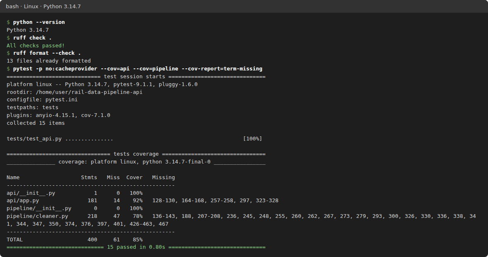

`ruff` reports no lint or formatting issues, and all 15 tests pass with 85%
line coverage across `api/` and `pipeline/`.

```bash
python --version
ruff check .
ruff format --check .
pytest -p no:cacheprovider --cov=api --cov=pipeline --cov-report=term-missing
```

### Figure 2 · Pipeline run on the real ORR file

The pipeline downloads Table 1410, keeps the raw file unchanged, and writes two
validated CSVs: 2,589 stations and 7,767 ticket-type rows. Three stations have
no reported usage and are kept as missing, not zero. The run recorded on the
server during the deploy is shown in [Figure 5](#figure-5--deploy-output-from-the-instance)
(the **Remote stderr** section). To run it locally:

```bash
python -m pipeline.cleaner
```

### Figure 3 · Validation stops bad data

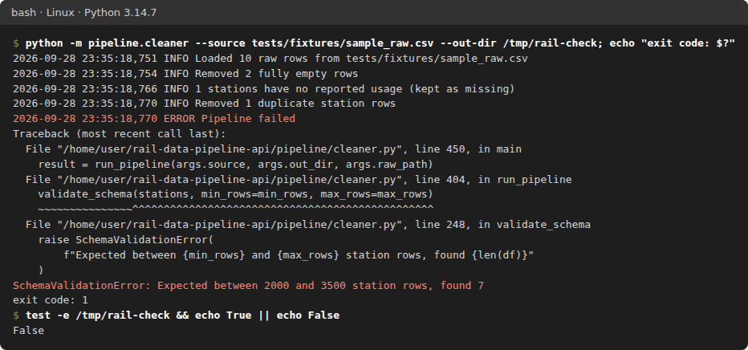

Fed the 7-station test fixture, the pipeline rejects it on the station-count
check, exits with code 1, and creates no output files.

```bash
python -m pipeline.cleaner --source tests/fixtures/sample_raw.csv --out-dir /tmp/rail-check; echo "exit code: $?"
test -e /tmp/rail-check && echo True || echo False
```

In PowerShell 7:

```powershell
python -m pipeline.cleaner --source tests/fixtures/sample_raw.csv --out-dir $env:TEMP\rail-check
"exit code: $LASTEXITCODE"
Test-Path $env:TEMP\rail-check
```

### Figure 4 · CI/CD run

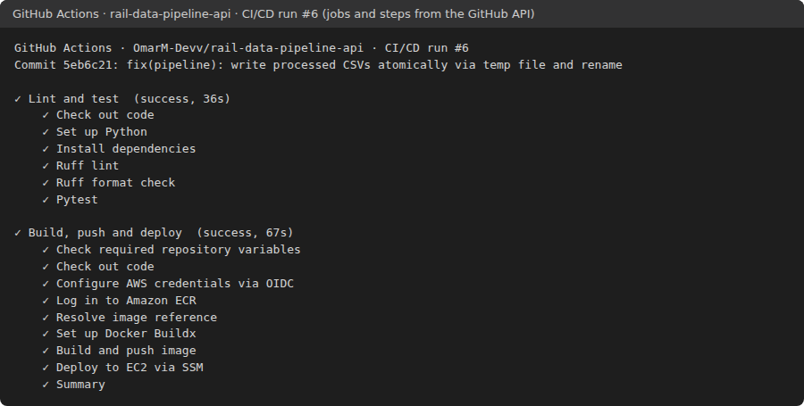

A push to `main`: the **Lint and test** job passes, then **Build, push and
deploy** assumes the AWS role through OIDC, pushes the image to ECR and deploys
over SSM. The image is rendered from the run's job and step data in the GitHub
API; the run itself is
[run #6](https://github.com/OmarM-Devv/rail-data-pipeline-api/actions/runs/36496421091).

### Figure 5 · Deploy output from the instance

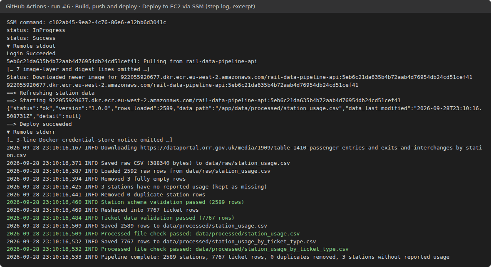

The **Deploy to EC2 via SSM** step with the instance's output expanded.
**Remote stdout** shows the new API container's `/health` response
(`rows_loaded: 2589`) and `Deploy succeeded`. **Remote stderr** holds the
pipeline container's log, ending `Pipeline complete: 2589 stations, 7767
ticket rows`. This is an excerpt of the step log from
[run #6](https://github.com/OmarM-Devv/rail-data-pipeline-api/actions/runs/36496421091),
with the omitted lines marked.

### Figure 6 · Health endpoint on the live instance

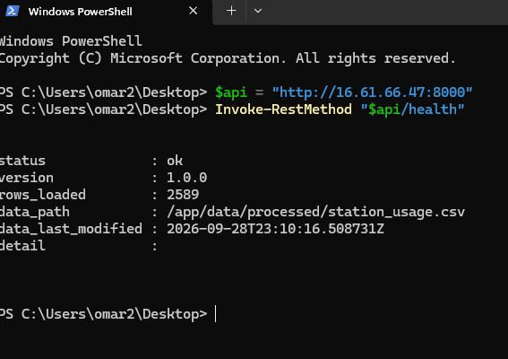

The deployed API reports `status: ok`, `rows_loaded: 2589` and the data
file's timestamp.

```powershell
Invoke-RestMethod "$api/health"
```

### Figure 7 · API documentation

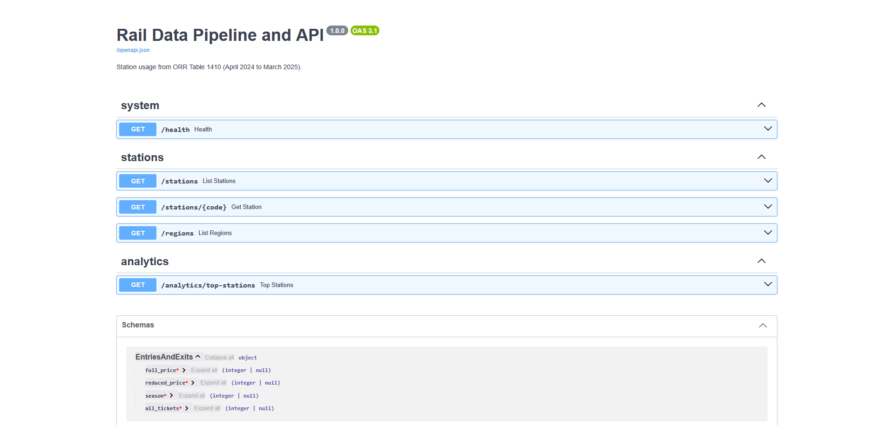

FastAPI's generated OpenAPI documentation at `$api/docs` on the live
instance.

### Figure 8 · Busiest stations

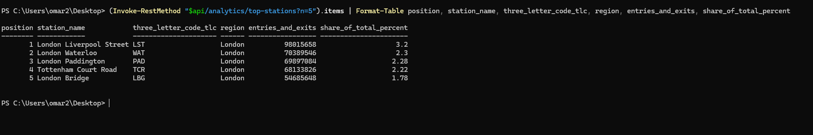

The five busiest stations by entries and exits from the live API, with each
station's share of the total. Stations without reported usage are excluded.

```powershell
(Invoke-RestMethod "$api/analytics/top-stations?n=5").items | Format-Table position, station_name, three_letter_code_tlc, region, entries_and_exits, share_of_total_percent
```

### Figure 9 · EC2 instance

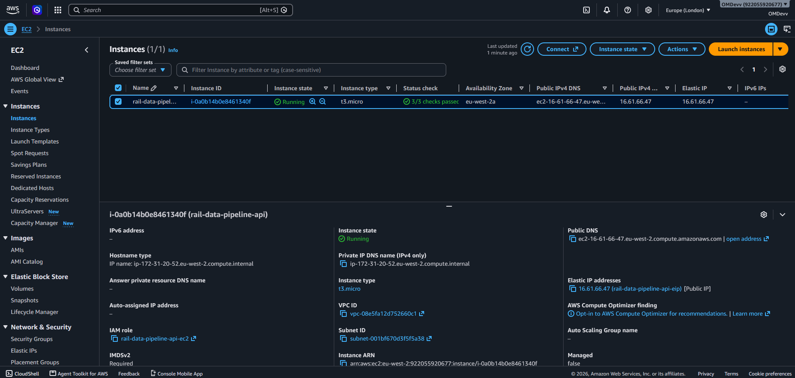

The instance created by Terraform: `t3.micro`, running, IMDSv2 required, with
the `rail-data-pipeline-api-ec2` instance profile.

### Figure 10 · ECR repository

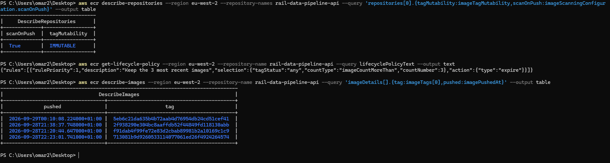

Tag immutability and scan on push are on, the lifecycle rule expires all but
the 3 most recent images, and each image is tagged with its commit SHA. ECR
applies lifecycle rules in the background, so a fourth image can remain for up
to a day after a new push, as it had here shortly after the latest deploy.

```powershell
aws ecr describe-repositories --region eu-west-2 --repository-names rail-data-pipeline-api --query 'repositories[0].{tagMutability:imageTagMutability,scanOnPush:imageScanningConfiguration.scanOnPush}' --output table
aws ecr get-lifecycle-policy --region eu-west-2 --repository-name rail-data-pipeline-api --query lifecyclePolicyText --output text
aws ecr describe-images --region eu-west-2 --repository-name rail-data-pipeline-api --query 'imageDetails[].{tag:imageTags[0],pushed:imagePushedAt}' --output table
```

### Figure 11 · OIDC trust policy

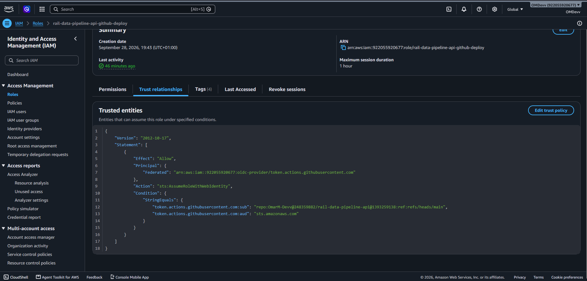

The deploy role's trust policy in the IAM console
(**Roles → rail-data-pipeline-api-github-deploy → Trust relationships**). The
`sub` condition names this repository and branch by numeric ID, and the `aud`
condition requires `sts.amazonaws.com`.

### Figure 12 · Container limits and hardening

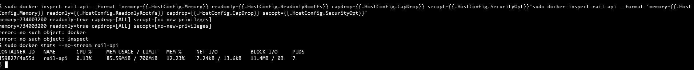

Inspected on the instance through SSM Session Manager: a memory limit of
734,003,200 bytes (700 MiB), a read-only root filesystem, all capabilities
dropped and `no-new-privileges`. `docker stats` shows current use against the
700 MiB limit.

```bash
sudo docker inspect rail-api --format 'memory={{.HostConfig.Memory}} readonly={{.HostConfig.ReadonlyRootfs}} capdrop={{.HostConfig.CapDrop}} secopt={{.HostConfig.SecurityOpt}}'
sudo docker stats --no-stream rail-api
```

## Data source

Contains public sector information from the Office of Rail and Road, licensed
under the [Open Government Licence v3.0](https://www.nationalarchives.gov.uk/doc/open-government-licence/version/3/).
